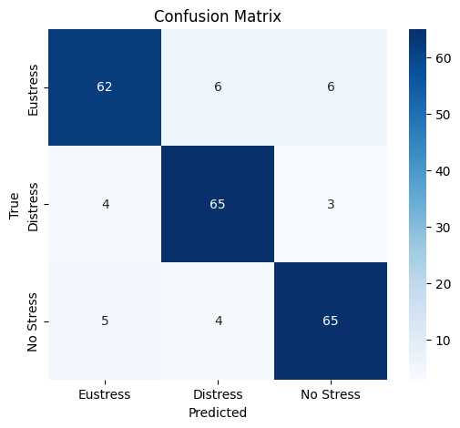
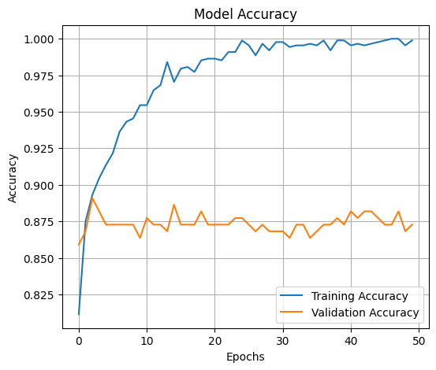

<h1 align="center">🎓 Stress Level Classification Model</h1>

  An <b>AI tool</b> that classifies student stress into 
  <b>Eustress</b>, <b>Distress</b>, or <b>No Stress</b>.

  
  
  
  

<h2>📌 Project Overview</h2>

This project uses <b>emotional, physical, academic, and social survey features</b> 
to classify stress. The notebook trains a <b>TensorFlow/Keras model</b>, evaluates it, and exports:
<ul>
  <li><code>stress_model.h5</code> (standard format)</li>
  <li><code>stress_model.tflite</code> (for mobile/web integration)</li>
</ul>

<h2>🧭 Quick Start</h2>
<pre>
# Clone repository
git clone https://github.com/antonyjoseph2111/students-stress-prediction-ai
cd YOUR_REPO

# Install dependencies
pip install -r requirements.txt

# Run notebook
jupyter notebook StressLevelModel.ipynb
</pre>

<h2>📁 Project Structure</h2>
<pre>
Stress-Classification-Model/
├─ StressLevelModel.ipynb
├─ StressLevelDataset.csv
├─ stress_model.h5
├─ stress_model.tflite (optional)
├─ requirements.txt
└─ README.md
</pre>

<h2>📈 Results Snapshot</h2>
<ul>
  <li><b>Accuracy:</b> ~89% (example)</li>
  <li><b>Classes:</b> Eustress · Distress · No Stress</li>
  <li><b>Export:</b> .h5 & .tflite</li>
</ul>

📷 Example (replace with your plots):

  
  

<h2>🛠️ Tech Stack</h2>
<ul>
  <li>Python 3.10</li>
  <li>TensorFlow / Keras</li>
  <li>scikit-learn, pandas, numpy</li>
  <li>matplotlib, seaborn</li>
</ul>

<h2>🔮 Future Improvements</h2>
<ul>
  <li>Deploy demo on <b>Streamlit Cloud / HuggingFace Spaces</b></li>
  <li>Add interactive <b>student questionnaire UI</b></li>
  <li>Test other models (<b>XGBoost / RandomForest</b>)</li>
</ul>

<h2>👨‍💻 Author</h2>

<b>Antony Joseph

GitHub: <a href="https://github.com/antonyjoseph2111">antonyjoseph2111</a>

<h2>📄 License</h2>

<a href="https://github.com/antonyjoseph2111">MIT License</a>

⭐ If you find this useful, give it a star!

